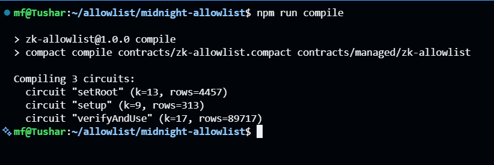
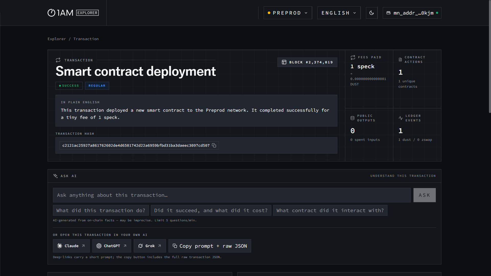
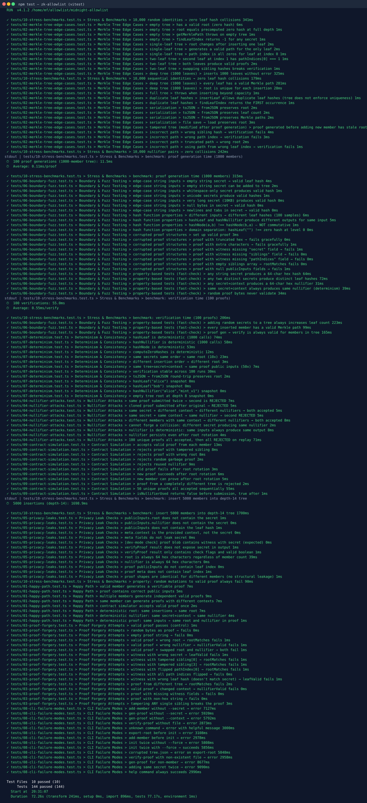

# ZK Allowlist: Privacy-Preserving Membership Proofs on Midnight

[](https://github.com/tusharpamnani/midnight-allowlist-demo) [](https://github.com/tusharpamnani/midnight-allowlist-demo) [](https://github.com/tusharpamnani/midnight-allowlist-demo) [](https://github.com/tusharpamnani/midnight-allowlist-demo) [](https://github.com/tusharpamnani/midnight-allowlist-demo) [](https://github.com/tusharpamnani/midnight-allowlist-demo/actions/workflows/test.yml)

A CLI-based Zero-Knowledge Allowlist system that lets users prove membership in a set **without revealing their identity**, built on Midnight's Compact contract language.

**[Live Demo](https://midnight-allowlist-demo.vercel.app/)** · Requires [1AM](https://1am.dev) or Lace wallet on Preprod

## Product Idea

ZK Allowlist is a privacy-preserving access-control layer for confidential communities and token-gated apps on Midnight. Instead of exposing a member's identity, wallet address, or even which anonymous tag they correspond to, any user can prove "I am on the list" with a zero-knowledge membership proof that leaks nothing about who they are. The product applies to gated Discord/Telegram communities, private beta whitelists, NFT allowlists, sybil-resistant airdrops, and anonymous sign-in — anywhere membership must be verifiable on-chain while the member stays anonymous. An admin manages the list by pushing a Merkle root; members generate proofs locally against that root and consume them exactly once via an on-chain nullifier, guaranteeing both privacy and replay protection.

## How It Works

```
┌──────────────────────────────────────────────────────────────────────┐
│                          PRIVACY MODEL                               │
│                                                                      │
│   PRIVATE (never leaves local machine)    PUBLIC (on-chain)          │
│   ─────────────────────────────────────   ──────────────────         │
│   • secret                                • Merkle root              │
│   • leaf hash                             • nullifier                │
│   • Merkle path                           • ZK proof                 │
│   • leaf index                                                       │
└──────────────────────────────────────────────────────────────────────┘
```

1. A **Sparse Merkle tree** (depth 10, up to 1024 members) is constructed locally using `persistentHash` (Poseidon).
2. The contract is initialized via **`setup(commitment)`**, pinning the administrator's authority.
3. The Merkle tree **root** is pushed on-chain via **`setRoot(root)`**, authorized by the admin's secret.
4. A user generates a **ZK proof** locally, proving their secret belongs to a leaf that leads to the public root.
5. The proof reveals only the nullifier, **not** the secret, leaf, or Merkle path.
6. The on-chain contract performs **10 levels of Merkle verification** within the ZK circuit to validate membership.


## Flow Overview

```
        ┌──────────────────────┐
        │   User Secret (s)    │
        └─────────┬────────────┘
                  │
                  ▼
        ┌──────────────────────┐
        │ hash(secret) → leaf  │
        └─────────┬────────────┘
                  │
                  ▼
        ┌──────────────────────────────┐
        │ Insert into Merkle Tree      │
        │ (local, private)             │
        └─────────┬────────────────────┘
                  │
                  ▼
        ┌──────────────────────────────┐
        │ Compute Merkle Root          │
        └─────────┬────────────────────┘
                  │
                  ▼
        ┌──────────────────────────────┐
        │ Store Root On-Chain          │
        └─────────┬────────────────────┘
                  │
                  ▼
        ┌──────────────────────────────┐
        │ Generate ZK Proof            │
        │ (secret + path + index)      │
        └─────────┬────────────────────┘
                  │
                  ▼
        ┌──────────────────────────────┐
        │ Compute Nullifier            │
        │ = persistentHash(s, ctx)     │
        └─────────┬────────────────────┘
                  │
                  ▼
        ┌──────────────────────────────┐
        │ Submit (proof, root,         │
        │         nullifier)           │
        └─────────┬────────────────────┘
                  │
                  ▼
        ┌──────────────────────────────┐
        │ On-chain Verification        │
        │                              │
        │ ✔ 10-level Merkle ZK proof   │
        │ ✔ Nullifier unused           │
        └─────────┬────────────────────┘
                  │
         ┌────────┴────────┐
         ▼                 ▼
   ACCEPT ✅          REJECT ❌
```
## Supported Baseline

| Component | Version |
|-----------|---------|
| Node.js | `v22+` |
| Compact | `0.5.1` |
| Compact compiler | `0.31.1` |
| Compact runtime | `0.16.0` |
| compact-js | `2.5.1` |
| Midnight.js | `4.1.1` |
| Wallet SDK | `1.2.0` |
| DApp Connector | `4.0.1` |
| Proof Server | `8.1.0` |
| Vitest | `4.x` |
| fast-check | `4.x` |

## Quick Start

```bash
npm install

# Initialize a Merkle tree (depth 10, up to 1024 members)
npm run zk -- init

# Add members
npm run zk -- add-member --secret alice
npm run zk -- add-member --secret bob

# Export the Merkle root
npm run zk -- export-root

# Securely initialize the contract (one-time setup)
npm run zk -- setup --admin-secret admin123

# Push the Merkle root to the on-chain contract (authorized by admin)
npm run zk -- set-root --admin-secret admin123

# Generate a ZK membership proof
npm run zk -- gen-proof --secret alice --context mint_v1

# Verify the proof locally
npm run zk -- verify-proof data/proof.json

# Submit to the on-chain contract
npm run zk -- submit-proof data/proof.json

# View tree, member, and nullifier stats
npm run zk -- status
```

## CLI Commands

| Command | Description |
|---------|-------------|
| `zk init` | Initialize Merkle tree and storage files |
| `zk init --depth <n>` | Set tree depth (default: 10, up to 1024 members) |
| `zk init --force true` | Overwrite an existing tree |
| `zk add-member --secret <s>` | Hash secret → leaf, insert into tree, update root |
| `zk export-root` | Print current Merkle root (JSON) |
| `zk setup --admin-secret <s>` | Pin admin to the contract (one-time) |
| `zk set-root --admin-secret <s>` | Authenticated Merkle root push |
| `zk gen-proof --secret <s> --context <c>` | Generate ZK membership proof |
| `zk gen-proof ... --output <file>` | Custom output path (default: `data/proof.json`) |
| `zk verify-proof <file>` | Verify a proof locally |
| `zk submit-proof <file>` | Submit proof to Midnight contract |
| `zk status` | Show tree depth, capacity, members, nullifiers |
| `zk help` | Print help message |

All commands output **deterministic JSON** for scripting. Example:

```json
{
  "success": true,
  "command": "add-member",
  "data": {
    "leaf": "c9fd090a9bf3194739695283582d2936bf90dd192d68b421656e461100744d5a",
    "leafIndex": 0,
    "newRoot": "482c86297ce70766fe4f67c5d7ec18d418a92f9852bf34ff1adcc87ce42f5fec",
    "totalMembers": 1
  },
  "timestamp": "2026-09-02T14:08:46.138Z"
}
```

## Project Structure

```
# Root (Next.js frontend)
├── app/
│   ├── page.tsx                    # Main UI: Deploy, Members, Admin, Verify sections
│   ├── layout.tsx                  # Root layout
│   └── hooks/
│       └── useContract.tsx         # Shared contract context (deploy, setup, setRoot, verifyAndUse)
├── contexts/
│   └── WalletContext.tsx           # 1AM wallet detection + connect
├── components/
│   └── WalletConnect.tsx           # Wallet connect UI
├── lib/
│   ├── contract.ts                 # Compiled contract factory (witness-wired)
│   ├── merkle.ts                   # Poseidon hashing + sparse Merkle tree (depth 10)
│   ├── midnight.ts                 # Session/providers/indexer wiring
│   └── crypto-utils.ts             # Hex + async SHA-256
├── public/
│   └── contract/zk-allowlist/      # ZK keys + zkir assets
│       ├── keys/                   # Prover keys (verifyAndUse: ~37MB)
│       └── zkir/                   # Circuit configs
│
# midnight-allowlist/ (Compact contract + CLI)
├── contracts/
│   └── zk-allowlist.compact        # On-chain Compact contract (depth 10)
├── contracts/managed/
│   └── zk-allowlist/               # Compiled artifacts
│       ├── contract/index.js       # Generated contract bindings
│       ├── keys/                   # Prover + verifier keys
│       ├── zkir/                   # Circuit configs
│       └── compiler/               # Compiler info
├── src/
│   ├── zk-cli.ts                   # CLI entry point (9 commands + help)
│   ├── deploy.ts                   # Contract deployment script
│   ├── utils.ts                    # Wallet, providers, compiled contract factory
│   ├── check-artifacts.ts          # Validates compiled ZK artifacts exist
│   ├── merkle-tree.ts              # Sparse Merkle tree (depth-configurable)
│   ├── poseidon.ts                 # PersistentHash (Poseidon) wrappers
│   ├── allowlist-utils.ts          # Proof gen/verify, member & nullifier mgmt
│   └── types.ts                    # Shared TypeScript type definitions
├── tests/
│   ├── helpers.ts                  # Test utilities & contract simulator
│   ├── 01-happy-path.test.ts       # Baseline sanity (8 tests)
│   ├── 02-merkle-tree-edge-cases.test.ts  # Tree edge cases (25 tests)
│   ├── 03-proof-forgery.test.ts    # Forgery attempts (17 tests)
│   ├── 04-nullifier-attacks.test.ts       # Replay & collision (9 tests)
│   ├── 05-privacy-leaks.test.ts    # Privacy verification (13 tests)
│   ├── 06-boundary-fuzz.test.ts    # Fuzz + fast-check (27 tests)
│   ├── 07-determinism.test.ts      # Determinism & snapshots (13 tests)
│   ├── 08-cli-failure-modes.test.ts       # CLI error handling (14 tests)
│   ├── 09-contract-simulation.test.ts     # Contract lifecycle (11 tests)
│   └── 10-stress-benchmarks.test.ts       # Stress & perf (7 tests)
├── data/                           # Auto-created local storage (gitignored)
│   ├── tree.json                   # Persisted Merkle tree
│   ├── members.json                # Member registry (dev-only)
│   ├── nullifiers.json             # Nullifier tracking
│   └── proof.json                  # Last generated proof
├── deployment.json                 # Written by deploy.ts; holds contract address & seed
├── .envrc                          # Environment variables (PRIVATE_STATE_PASSWORD etc.)
├── tsconfig.json
├── vitest.config.ts
└── package.json
```

## Compact Contract

The `contracts/zk-allowlist.compact` contract stores three pieces of public state:

| Field | Type | Purpose |
|-------|------|---------|
| `merkle_root` | `Bytes<32>` | Current Merkle tree root |
| `admin_commitment` | `Bytes<32>` | Hash of admin secret (Governance) |
| `used_nullifiers` | `Set<Bytes<32>>` | Consumed nullifiers (replay protection) |

And exposes three circuits:

| Circuit | What it does |
|---------|--------------|
| `setup(commitment)` | One-time admin configuration |
| `setRoot(new_root)` | Authenticated Merkle root update |
| `verifyAndUse(nullifier)` | Verify 10-level Merkle path in ZK and record nullifier |

To compile the contract:

```bash
npm run compile
```

Successful compile output (all 3 circuits build into `contracts/managed/`):



## Deployment Info (Preprod Network)

The following contract has been deployed to the Midnight **preprod** network via the 1AM wallet frontend:

The following contract has been deployed to the Midnight **preprod** network via the 1AM wallet frontend:

| Field | Value |
|-------|-------|
| Contract Address | `e8a4ceffab33dba6dc1252a010c866d0db8c616d7f0f67b9106cfda9fda2e56a` |
| Merkle Root | `60b7e06fb3fa7461025ec7ad919b68c45fa886000e619d5f655553c83fe9145f` |
| Admin Commitment | `249cb77109236a54e1efb83d47cfd7f9d20a055ad6e0510c3ed98ef7d2761e30` |
| Nullifiers Used | `1` |
| Last Tx | `midnight:transaction[v9][signature]` |

Deployed contract as shown on the preprod network:



## Next.js Frontend

A full browser frontend lives at the repo root (`/home/mf/allowlist`), connecting to the 1AM wallet on the preprod network:

```bash
# From repo root
npm install
npm run dev -- --webpack
```

The frontend supports:
- **Connect Wallet** — 1AM browser extension, preprod network
- **Deploy** — deploys a new ZK allowlist contract
- **Members (local)** — add member secrets locally, builds the Merkle tree in-browser (persisted to localStorage)
- **Admin** — Setup Admin (first-time), Sync Local Root (pushes tree root to chain)
- **Verify & Use** — prove membership with a ZK proof, record nullifier on-chain; confetti on success

Key files:
- `lib/contract.ts` — compiled contract factory (witness-wired)
- `lib/merkle.ts` — Poseidon hashing + sparse Merkle tree (depth 10)
- `lib/midnight.ts` — session/providers/indexer wiring
- `contexts/WalletContext.tsx` — 1AM wallet detection + connect
- `app/hooks/useContract.tsx` — shared contract context (deploy, setup, setRoot, verifyAndUse)
- `app/page.tsx` — UI sections (Deploy, Members, Admin, Verify)

## Public State vs Private Witness

Midnight splits a contract into **public ledger state** (visible to everyone) and **private witness data** (held only by the prover and never published).

### Public State (on-chain, everyone can read)

| Field | Type | Purpose | Info leaked |
|-------|------|---------|-------------|
| `merkle_root` | `Bytes<32>` | Current Merkle tree root | Reveals that *some* set of members exists, but not their identities |
| `admin_commitment` | `Bytes<32>` | Hash of admin secret | A commitment — reveals nothing about the admin secret |
| `used_nullifiers` | `Set<Bytes<32>>` | Consumed nullifiers | Reveals membership *was* proven, but not by whom |

### Private Witness (prover-only, never on-chain)

| Field | Type | Purpose |
|-------|------|---------|
| `secret` | `Bytes<32>` | The member's identity input |
| `siblings` | `Vector<10, Bytes<32>>` | Merkle path siblings |
| `path_indices` | `Vector<10, Boolean>` | Left/right choice at each level |
| `context` | `Bytes<32>` | Domain context (nullifier binding) |

The on-chain verifier checks the ZK proof against only the public root. The secret, leaf, path, and index exist solely inside the prover's witness — the network never sees them, and the proof is zero-knowledge: it can't be inverted to recover them.

## Privacy Claim

**A member can prove they are on the allowlist without revealing who they are.**

The ZK circuit (`verifyAndUse`) proves knowledge of a secret whose Poseidon hash is a leaf in the on-chain Merkle tree — without disclosing the secret, the leaf, the leaf index, or the Merkle path. The only on-chain artifact of a proof is a domain-separated nullifier (`persistentHash(tag || secret || context)`), which prevents double-use while remaining unlinkable to the member's identity. Even a full transcript observer learns nothing beyond the fact that *some* valid member consumed a slot.

## Security Model

### Privacy Guarantees

The verifier (on-chain contract) sees **only**:
- The Merkle root
- The nullifier
- A valid ZK proof

The verifier does **not** see:
- Which secret was used
- Which leaf in the tree
- The member's position (index)
- The Merkle path

### What an Observer Can and Cannot Learn

An observer monitoring the chain (indexer, explorer, anyone) **can** learn:
- That a contract named zk-allowlist exists with a Merkle root and an admin commitment
- That a valid membership proof was submitted and a nullifier was consumed
- How many members-proven events have occurred (size of `used_nullifiers`)

An observer **cannot** learn:
- Which member (secret) produced any given nullifier — nullifiers are unlinkable hashes
- Whether two nullifiers were produced by the same or different members
- The admin secret behind `admin_commitment`
- The Merkle path, leaf position, or any witness data
- Any information about members never proven on-chain

### Replay Protection

Each proof includes a **nullifier** = `persistentHash(tag || secret || context)`:
- Same secret + same context → same nullifier → **rejected** on reuse
- Same secret + different context → different nullifier → **accepted**
- Different secrets + same context → different nullifiers → **accepted**

### Hashing
 
All cryptographic hashing utilizes **persistentHash (Poseidon)**, the native ZK-friendly hash of the Midnight network, ensuring high performance inside circuits:
- `zk-allowlist:leaf:v1` : leaf computation (`persistentHash<Vector<2, Bytes<32>>>`)
- `zk-allowlist:node:v1` : Merkle node computation (`persistentHash<Vector<3, Bytes<32>>>`)
- `zk-allowlist:nullifier:v1` : nullifier computation (`persistentHash<Vector<3, Bytes<32>>>`)
- `zk-allowlist:admin:v1` : admin authentication (`persistentHash<Vector<2, Bytes<32>>>`)

For witness compatibility, user-provided string secrets are normalized into 32-byte field elements using **SHA-256** before being hashed into the tree.

### Important

- **Do NOT** store secrets in `members.json` in production, it exists for development only
- Use a fresh `--context` for each proof to avoid nullifier correlation
- The `data/` directory is gitignored and should never be committed

## Test Suite

### Overview

**144 tests** across 10 test files, using Vitest + fast-check for property-based testing.

```
 Test Files  10 passed (10)
      Tests  144 passed (144)
   Duration  ~10s
```



### Test Commands

```bash
npm test               # Run all 144 tests
npm run test:watch     # Watch mode
npm run test:edge      # Merkle tree + proof forgery (42 tests)
npm run test:zk        # Nullifiers + privacy + contract sim (33 tests)
npm run test:fuzz      # Boundary/fuzz + stress (34 tests)
npm run test:bench     # Benchmarks only (7 tests)
```

### Test Categories

#### 1. Happy Path: `01-happy-path.test.ts` (8 tests)

Baseline sanity: valid members generate, verify, and submit proofs. Multiple members work independently. Root, nullifier, and proof outputs are deterministic.

#### 2. Merkle Tree Edge Cases: `02-merkle-tree-edge-cases.test.ts` (25 tests)

| Scenario | What is tested |
|----------|----------------|
| Empty tree | `getMerklePath` throws, `findLeafIndex` returns `-1` |
| Single-leaf tree | Valid path, all path indices zero |
| Two-leaf tree | Swapping siblings breaks verification |
| Deep tree (1000 leaves) | Spot-check 8 random indices, unique roots per insertion |
| Full tree (capacity overflow) | Throws on insert beyond capacity |
| Duplicate leaf hashes | `insertLeaf` allows; `findLeafIndex` returns first |
| Serialization round-trip | `toJSON` → `fromJSON` preserves root, leaves, paths |
| Tampered tree | Proof valid against old root, invalid against new root |
| Wrong sibling hash | Verification fails |
| Wrong path index | Verification fails |
| Truncated path | Verification fails |
| Path from wrong leaf | Verification fails |

#### 3. Proof Forgery Attempts: `03-proof-forgery.test.ts` (17 tests)

Every invalid manipulation **must** return `valid === false`:

| Attack | Failing check |
|--------|---------------|
| Random bytes as proof | `proofDecoded` |
| Empty proof string | `proofDecoded` |
| Valid proof + wrong root | `rootMatches` |
| Valid proof + wrong nullifier | `nullifierValid` |
| Swapped root ↔ nullifier | Both |
| Wrong secret in witness | `leafValid` |
| Tampered sibling (positions 0 and 3) | `rootMatches` |
| Flipped path index | `rootMatches` |
| All path indices flipped | `rootMatches` |
| Wrong leaf hash in witness | `leafValid` |
| Proof from a different tree | `rootMatches` |
| Changed context | `nullifierValid` |
| Missing witness fields | `proofDecoded` |
| Non-hex proof string | `proofDecoded` |
| Tampering **ANY** single sibling | `rootMatches` (exhaustive) |

#### 4. Nullifier Attacks: `04-nullifier-attacks.test.ts` (9 tests)

| Attack | Expected result |
|--------|----------------|
| Same proof submitted twice | 2nd **rejected** |
| Cloned proof after original | **Rejected** |
| Same secret, different context | Both **accepted** (different nullifiers) |
| Same secret + same context | 2nd **rejected** (same nullifier) |
| Different secrets, same context | Both **accepted** |
| Concatenation collision attempt | Different hashes (length-prefix fix) |
| Determinism (100 identical calls) | All equal |
| Nullifier persists after root rotation | Still blocked |
| 50-member bulk accept → replay all | All **rejected** |

#### 5. Privacy Leak Checks: `05-privacy-leaks.test.ts` (13 tests)

Verifies that **no** output or error message exposes:
- The secret
- The leaf hash
- The Merkle path / siblings
- The leaf index

Also verifies that proof shapes are **identical** across different members (no structural leakage).

#### 6. Boundary & Fuzz: `06-boundary-fuzz.test.ts` (27 tests)

Edge-case inputs:

| Input | Behavior |
|-------|----------|
| Empty string secret | Valid 64-char hex hash |
| Whitespace-only secret | Valid, distinct from empty |
| Unicode secrets (`🔐`, `密码`, `пароль`) | Valid hashes |
| 10KB secret | Valid hash |
| Null bytes | Valid hash |
| Truncated proof hex | Fails gracefully |
| Missing witness fields | Fails gracefully |
| Null `publicInputs` fields | Fails gracefully |

Property-based tests (fast-check):

| Property | Runs |
|----------|------|
| Any string → valid 64-char hex leaf hash | 500 |
| Distinct secrets → distinct hashes | 500 |
| Any secret+context → valid 64-char nullifier | 500 |
| Deterministic nullifiers | 300 |
| Random hex never validates as proof | 200 |
| Random secrets increase leaf count | 100 |
| Every inserted member has valid Merkle path | 50 |
| Proof gen → verify always valid for members | 100 |

#### 7. Determinism & Snapshots: `07-determinism.test.ts` (13 tests)

- All hash functions deterministic across 1000 calls
- Same insertion order → same root (10 iterations)
- Different insertion order → different root
- Proof public inputs stable across 50 iterations
- Verification stable across 100 iterations
- Serialization round-trip stable

Pinned regression snapshots:

| Value | Hash |
|-------|------|
| `hashLeaf("alice")` | `c9fd090a...` |
| `hashLeaf("bob")` | `b29f6d6d...` |
| `hashNullifier("alice", "mint_v1")` | `f2ab810c...` |
| Empty tree root (depth 8) | `77ed676b...` |

#### 8. CLI Failure Modes — `08-cli-failure-modes.test.ts` (14 tests)

Tests real CLI execution via `execSync`:

| Scenario | Expected |
|----------|----------|
| `add-member` without `--secret` | Error with `success: false` |
| `gen-proof` without `--secret` | Error |
| `gen-proof` without `--context` | Error |
| `verify-proof` without file | Error |
| Unknown command | Error with "Unknown command" |
| `export-root` before `init` | Error |
| `add-member` before `init` | Error |
| `init` twice without `--force` | Error with "already exists" |
| `init` twice with `--force` | Succeeds |
| Corrupted `tree.json` | Error on `export-root` |
| Non-existent proof file | Error with "not found" |
| `gen-proof` for non-member | Error with "not found" |
| Duplicate member | Error with "already in tree" |
| `help` command | Always succeeds |

#### 9. Contract Simulation: `09-contract-simulation.test.ts` (11 tests)

Full contract lifecycle using an in-memory `ContractSimulator`:

| Scenario | Result |
|----------|--------|
| Valid proof from each member | Accepted |
| Tampered sibling in proof | Rejected |
| Wrong root in proof | Rejected |
| Random garbage proof | Rejected |
| Reused nullifier | Rejected |
| Old proof after root rotation | Rejected ("Root mismatch") |
| New proof after root rotation | Accepted |
| New member after root rotation | Accepted |
| Cross-tree proof | Rejected |
| 50-member bulk acceptance | All accepted |
| `isNullifierUsed` state check | Correct before/after |

#### 10. Stress & Benchmarks: `10-stress-benchmarks.test.ts` (7 tests)

| Test | Result |
|------|--------|
| 10k random identities → leaf collisions | **0 collisions** |
| 10k sequential identities → leaf collisions | **0 collisions** |
| 10k nullifier pairs → collisions | **0 collisions** |
| 100 proof generations (1000-member tree) | **~1.7ms** (0.02ms/proof) |
| 100 proof verifications | **~3.5ms** (0.03ms/verify) |
| 5000 insertions (depth-14 tree) | **~120ms** |
| Property: random mutations never forge valid proof | 200 runs, all fail |

### Bug Found by Tests

The proof generator originally used simple string concatenation for hashing, leading to potential ambiguities (e.g., `hash("alice" + "ctx1")` === `hash("alic" + "ectx1")`).

**Fix**: The system was upgraded to use `persistentHash` with **type-aligned vectors** (e.g., `Vector<3, Bytes<32>>`). Since the Midnight SDK handles the alignment and padding of vector elements individually, concatenation ambiguity is mathematically impossible.

## Troubleshooting

**Tree not initialized:**

```text
Tree file not found: data/tree.json. Run 'zk init' first.
```

Run `npm run zk -- init` to create the tree.

**Duplicate member:**

```text
Secret already in tree at index 0
```

Each secret can only be added once.

**Non-member proof generation:**

```text
Secret not found in the tree. Add the member first.
```

Run `npm run zk -- add-member --secret <s>` before generating a proof.

**Corrupted `data/tree.json`:**

Delete `data/` and re-initialize:

```bash
rm -rf data
npm run zk -- init
```